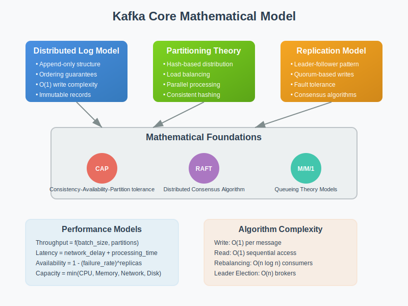

# Core Model: Kafka's Mathematical Foundation

## Overview

This section explores the mathematical models that underpin Apache Kafka's distributed streaming architecture. Understanding these core mathematical concepts is essential for designing robust, scalable streaming systems.

## Key Mathematical Models

### 1. Distributed Log Model
- **Log-Structured Storage**: Mathematical properties of append-only logs
- **Ordering Guarantees**: Partial ordering in distributed systems
- **Consistency Models**: Strong vs eventual consistency in streaming contexts

### 2. Partitioning Theory
- **Hash-based Partitioning**: Distribution algorithms and load balancing
- **Consistent Hashing**: Minimizing rebalancing overhead
- **Partition Assignment**: Optimal distribution strategies

### 3. Replication Models
- **Leader-Follower Replication**: Consensus algorithms and fault tolerance
- **Replication Factor**: Mathematical trade-offs between durability and performance
- **Quorum-based Systems**: Vote counting and split-brain prevention

### 4. Consumer Group Protocol
- **Load Balancing Algorithms**: Fair partition distribution
- **Rebalancing Protocol**: Minimizing processing interruption
- **Offset Management**: Tracking consumption progress mathematically

## Mathematical Foundations

### Distributed Systems Theory
Kafka applies fundamental distributed systems concepts:
- **CAP Theorem**: Consistency, Availability, and Partition tolerance trade-offs
- **RAFT Consensus**: Leader election and log replication algorithms
- **Vector Clocks**: Ordering events in distributed systems

### Information Theory
Message processing efficiency through:
- **Compression Algorithms**: Reducing network bandwidth
- **Serialization Formats**: Optimal data representation
- **Batching Strategies**: Throughput optimization

### Queueing Theory
Performance modeling using:
- **Little's Law**: Relationship between throughput, latency, and queue length
- **M/M/1 Queues**: Producer-consumer performance analysis
- **Backpressure Models**: Flow control mechanisms

## Core Algorithms

### Producer Algorithms
1. **Partitioner Algorithm**: Hash-based message routing
2. **Batching Algorithm**: Optimizing network efficiency
3. **Retry Logic**: Exponential backoff and failure handling

### Consumer Algorithms
1. **Partition Assignment**: Range and round-robin strategies
2. **Offset Commit**: Consistency and fault tolerance
3. **Rebalancing**: Dynamic partition redistribution

### Broker Algorithms
1. **Leader Election**: Distributed consensus implementation
2. **Log Compaction**: Space-efficient storage strategies
3. **Index Management**: Fast message retrieval

## Performance Models

### Throughput Analysis
Mathematical models for:
- **Producer Throughput**: Batch size vs latency trade-offs
- **Consumer Throughput**: Parallelism and partition count optimization
- **Broker Throughput**: Network and disk I/O limitations

### Latency Models
Analysis of:
- **End-to-End Latency**: Producer to consumer delay
- **Replication Latency**: Consistency vs performance trade-offs
- **Network Latency**: Impact on distributed operations

## Next Steps

- **02-math-toolkit/**: Tools and techniques for applying these mathematical models
- **03-algorithms/**: Detailed algorithm implementations and optimizations
- **04-failure-models/**: Mathematical analysis of failure scenarios
- **05-experiments/**: Hands-on validation of mathematical models