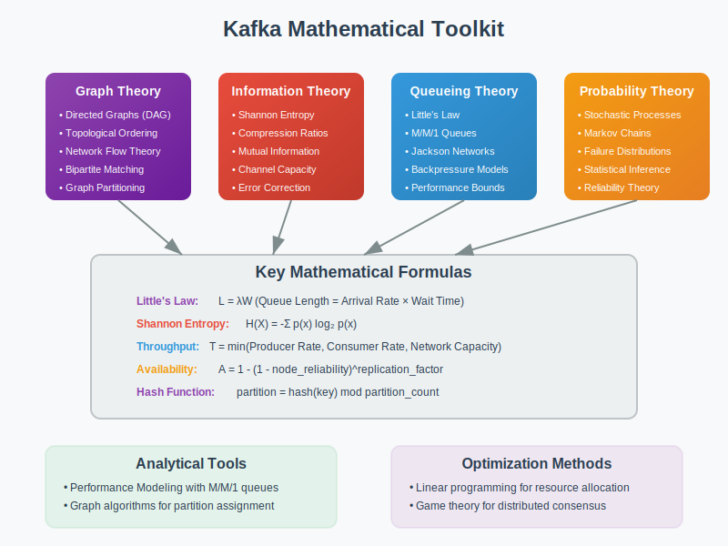

# Math Toolkit: Kafka Implementation Tools



## Overview

This toolkit provides mathematical tools, formulas, and techniques for implementing, configuring, and optimizing Kafka clusters. These tools translate theoretical concepts into practical solutions.

## Performance Calculation Tools

### Throughput Estimation
```
Producer Throughput = (Batch Size × Compression Ratio) / (Network Latency + Serialization Time)

Consumer Throughput = Partition Count × (Message Size / Processing Time)

Cluster Throughput = min(Network Bandwidth, Disk I/O, CPU Capacity)
```

### Latency Analysis
```
End-to-End Latency = Producer Latency + Broker Processing + Consumer Latency

Producer Latency = Serialization + Network Round Trip + Acknowledgment Wait

Consumer Latency = Fetch Request + Deserialization + Processing Time
```

## Partitioning Mathematics

### Optimal Partition Count
```
Partition Count = max(Target Throughput / Partition Throughput, Consumer Count)

Hash Function: partition = hash(key) mod partition_count

Load Balance Factor = max(partition_load) / avg(partition_load)
```

### Rebalancing Cost
```
Rebalance Time = (Partition Count / Consumer Count) × Average Processing Time

Migration Cost = (Messages in Flight) × (Average Message Size) / Network Bandwidth
```

## Replication Mathematics

### Durability vs Performance Trade-offs
```
Replication Factor = log₂(Acceptable Data Loss Probability) / log₂(Node Failure Rate)

Consistency Level: Quorum Size = (Replication Factor / 2) + 1

Recovery Time = (Log Size / Network Bandwidth) × Replication Factor
```

### Availability Calculation
```
Availability = 1 - (Node Failure Rate)^(Replication Factor)

MTTR = (Detection Time + Leader Election Time + Sync Time)
```

## Resource Planning Formulas

### Storage Requirements
```
Total Storage = Message Rate × Average Message Size × Retention Period × Replication Factor

Log Segment Size = min(Disk Space / 10, 1GB)

Index Size = (Message Count / Index Interval) × Index Entry Size
```

### Memory Planning
```
Producer Memory = Batch Size × Partition Count × Buffer Count

Consumer Memory = Fetch Size × Partition Count × Prefetch Factor

Broker Memory = Page Cache Size + JVM Heap + Off-heap Buffers
```

### Network Bandwidth
```
Required Bandwidth = (Producer Rate + Consumer Rate) × Replication Factor × Safety Margin

Network Utilization = Actual Traffic / Available Bandwidth

Bottleneck Detection = max(CPU%, Memory%, Disk I/O%, Network%)
```

## Optimization Algorithms

### Batch Size Optimization
```python
def optimal_batch_size(latency_target, throughput_target):
    batch_sizes = range(1, 10000, 100)
    optimal = None
    
    for batch_size in batch_sizes:
        latency = calculate_latency(batch_size)
        throughput = calculate_throughput(batch_size)
        
        if latency <= latency_target and throughput >= throughput_target:
            optimal = batch_size
            break
    
    return optimal
```

### Consumer Lag Calculation
```python
def consumer_lag_analysis(topic_offsets, consumer_offsets):
    total_lag = 0
    
    for partition in topic_offsets:
        partition_lag = topic_offsets[partition] - consumer_offsets[partition]
        total_lag += partition_lag
    
    return {
        'total_lag': total_lag,
        'avg_lag_per_partition': total_lag / len(topic_offsets),
        'processing_time_behind': total_lag / average_consumption_rate
    }
```

## Configuration Optimization Tools

### Producer Configuration
```
# Throughput Optimization
batch.size = min(16384, average_message_size * 100)
linger.ms = latency_budget / 2
buffer.memory = batch.size * partition_count * 32

# Reliability Configuration
acks = replication_factor  # or 'all' for maximum durability
retries = Integer.MAX_VALUE
enable.idempotence = true
```

### Consumer Configuration
```
# Performance Tuning
fetch.min.bytes = average_message_size * 10
fetch.max.wait.ms = acceptable_latency
max.poll.records = processing_capacity / average_processing_time

# Reliability Settings
enable.auto.commit = false  # Manual offset management
auto.offset.reset = 'earliest'  # Prevent data loss
```

### Broker Configuration
```
# Storage Optimization
log.segment.bytes = disk_space / (retention_hours * segments_per_hour)
log.retention.hours = business_requirement
log.cleanup.policy = 'delete' or 'compact'

# Network Tuning
socket.send.buffer.bytes = network_bandwidth / active_connections
socket.receive.buffer.bytes = socket.send.buffer.bytes
num.network.threads = cpu_cores / 2
```

## Monitoring and Alerting Formulas

### Key Performance Indicators
```
# Lag Monitoring
Consumer Lag Ratio = Current Lag / Maximum Acceptable Lag

# Throughput Monitoring  
Throughput Utilization = Actual Rate / Maximum Capacity

# Error Rate Monitoring
Error Rate = Failed Requests / Total Requests

# Availability Monitoring
Uptime Percentage = (Total Time - Downtime) / Total Time
```

### Alert Thresholds
```python
def calculate_alert_thresholds(baseline_metrics, sensitivity=0.8):
    return {
        'high_lag': baseline_metrics['avg_lag'] * (1 + sensitivity),
        'low_throughput': baseline_metrics['avg_throughput'] * (1 - sensitivity),
        'high_error_rate': baseline_metrics['avg_error_rate'] * (1 + sensitivity * 2),
        'disk_usage': 0.85,  # 85% disk utilization
        'memory_usage': 0.80  # 80% memory utilization
    }
```

## Capacity Planning Tools

### Growth Projection
```python
def project_kafka_capacity(current_metrics, growth_rate_monthly, months_ahead):
    projected_message_rate = current_metrics['message_rate'] * (1 + growth_rate_monthly) ** months_ahead
    projected_data_volume = current_metrics['data_volume'] * (1 + growth_rate_monthly) ** months_ahead
    
    return {
        'required_partitions': int(projected_message_rate / max_partition_rate) + 1,
        'required_brokers': int(projected_data_volume / broker_capacity) + 1,
        'required_storage': projected_data_volume * retention_factor * replication_factor
    }
```

### Load Testing Calculations
```
Test Message Rate = Production Rate × Safety Factor × Growth Projection

Test Duration = max(2 × Retention Period, 24 hours)

Success Criteria:
- Latency p99 < SLA Target
- Zero Message Loss
- Consumer Lag < Threshold
```

## Troubleshooting Formulas

### Performance Bottleneck Analysis
```python
def identify_bottleneck(metrics):
    bottlenecks = {}
    
    if metrics['cpu_usage'] > 80:
        bottlenecks['cpu'] = 'Consider increasing num.io.threads'
    
    if metrics['network_usage'] > 85:
        bottlenecks['network'] = 'Increase socket buffer sizes'
    
    if metrics['disk_io_wait'] > 30:
        bottlenecks['disk'] = 'Consider faster storage or more brokers'
    
    if metrics['memory_usage'] > 85:
        bottlenecks['memory'] = 'Increase JVM heap or add more brokers'
    
    return bottlenecks
```

### Rebalancing Time Estimation
```
Rebalance Duration = (Partition Assignment Time + Migration Time + Stabilization Time)

where:
- Partition Assignment Time = O(log(consumers))
- Migration Time = (Active Messages × Message Size) / Network Bandwidth
- Stabilization Time = 2 × session.timeout.ms
```

## Next Steps

- **03-algorithms/**: Deep dive into specific algorithm implementations
- **04-failure-models/**: Apply these tools to failure scenario analysis
- **05-experiments/**: Hands-on validation of calculations and formulas