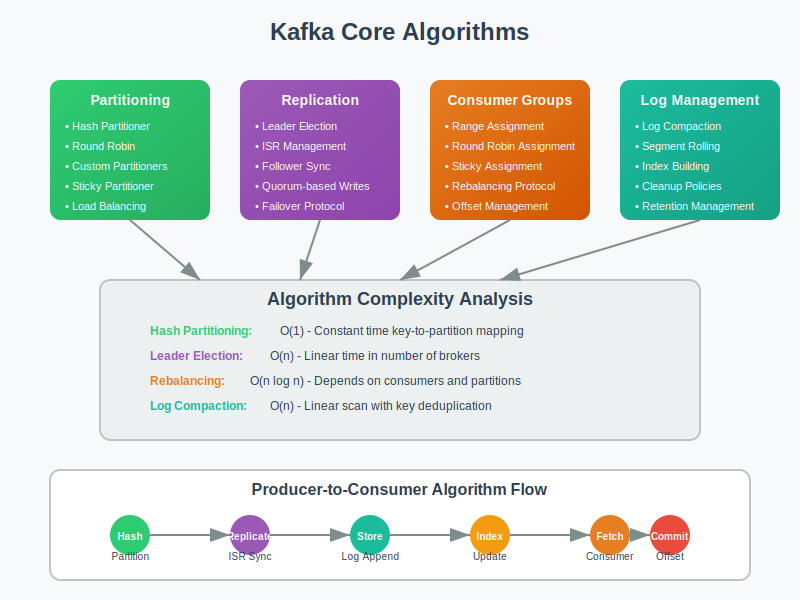

# Algorithms: Kafka's Core Implementation



## Overview

This section explores the key algorithms that make Kafka's distributed streaming platform possible. Understanding these algorithms is crucial for optimizing performance and troubleshooting issues.

## Producer Algorithms

### 1. Message Partitioning Algorithm
```java
// Default partitioner implementation
public int partition(String topic, Object key, byte[] keyBytes, 
                    Object value, byte[] valueBytes, Cluster cluster) {
    List<PartitionInfo> partitions = cluster.partitionsForTopic(topic);
    int numPartitions = partitions.size();
    
    if (keyBytes == null) {
        // Round-robin for null keys
        return Utils.toPositive(Utils.murmur2(topicCounterMap.get(topic))) % numPartitions;
    } else {
        // Hash-based partitioning for keyed messages
        return Utils.toPositive(Utils.murmur2(keyBytes)) % numPartitions;
    }
}
```

### 2. Batching Algorithm
- **Objective**: Maximize throughput while respecting latency constraints
- **Strategy**: Collect messages until batch size or linger time is reached
- **Trade-off**: Larger batches improve throughput but increase latency

### 3. Retry Algorithm with Exponential Backoff
```python
def retry_with_backoff(operation, max_retries=5, base_delay=100):
    for attempt in range(max_retries):
        try:
            return operation()
        except RetriableException as e:
            if attempt == max_retries - 1:
                raise e
            
            delay = base_delay * (2 ** attempt) + random.uniform(0, base_delay)
            time.sleep(delay / 1000)  # Convert to seconds
```

## Consumer Algorithms

### 1. Partition Assignment Algorithm

#### Range Assignment Strategy
```python
def range_assignment(consumers, partitions):
    consumers_sorted = sorted(consumers)
    partitions_per_consumer = len(partitions) // len(consumers)
    extra_partitions = len(partitions) % len(consumers)
    
    assignment = {}
    partition_index = 0
    
    for i, consumer in enumerate(consumers_sorted):
        partitions_count = partitions_per_consumer + (1 if i < extra_partitions else 0)
        assignment[consumer] = partitions[partition_index:partition_index + partitions_count]
        partition_index += partitions_count
    
    return assignment
```

#### Round-Robin Assignment Strategy
```python
def round_robin_assignment(consumers, partitions):
    consumers_sorted = sorted(consumers)
    assignment = {consumer: [] for consumer in consumers_sorted}
    
    for i, partition in enumerate(partitions):
        consumer = consumers_sorted[i % len(consumers_sorted)]
        assignment[consumer].append(partition)
    
    return assignment
```

### 2. Consumer Rebalancing Algorithm
1. **Join Group**: Consumer sends join request to group coordinator
2. **Select Leader**: Group coordinator selects consumer with shortest member ID
3. **Sync Group**: Leader performs partition assignment and sends to coordinator
4. **Assignment Distribution**: Coordinator distributes assignments to all members
5. **Heartbeat**: Consumers send periodic heartbeats to maintain membership

### 3. Offset Commit Strategy
```python
def commit_offsets(consumer, strategy='periodic'):
    if strategy == 'periodic':
        # Commit every 5 seconds or 1000 messages
        if time_since_last_commit() > 5000 or messages_since_commit() > 1000:
            consumer.commit_sync()
    
    elif strategy == 'after_processing':
        # Commit after each message is processed
        consumer.commit_sync()
    
    elif strategy == 'batch':
        # Commit after processing a batch of messages
        if len(processed_messages) >= batch_size:
            consumer.commit_sync()
```

## Broker Algorithms

### 1. Leader Election Algorithm (Simplified Raft)
```python
class LeaderElection:
    def __init__(self, broker_id, brokers):
        self.broker_id = broker_id
        self.brokers = brokers
        self.term = 0
        self.state = 'follower'
        self.leader = None
        self.votes_received = 0
    
    def start_election(self):
        self.term += 1
        self.state = 'candidate'
        self.votes_received = 1  # Vote for self
        
        for broker in self.brokers:
            if broker != self.broker_id:
                if self.request_vote(broker):
                    self.votes_received += 1
        
        if self.votes_received > len(self.brokers) // 2:
            self.become_leader()
    
    def become_leader(self):
        self.state = 'leader'
        self.leader = self.broker_id
        self.send_heartbeats()
```

### 2. Log Replication Algorithm
```python
def replicate_message(leader, followers, message):
    # Phase 1: Write to leader's log
    leader_offset = leader.append_to_log(message)
    
    # Phase 2: Send to followers
    replication_futures = []
    for follower in followers:
        future = follower.replicate_async(message, leader_offset)
        replication_futures.append(future)
    
    # Phase 3: Wait for acknowledgments based on acks setting
    if acks == 'all':
        # Wait for all replicas
        wait_for_all(replication_futures)
    elif acks == 1:
        # Only wait for leader write
        pass
    elif acks == 0:
        # No acknowledgment needed
        pass
    
    return leader_offset
```

### 3. Log Compaction Algorithm
```python
def compact_log(topic_partition):
    # Build offset map for latest values of each key
    offset_map = {}
    
    # Scan log segments from newest to oldest
    for segment in reversed(topic_partition.segments):
        for message in segment.messages:
            if message.key not in offset_map:
                offset_map[message.key] = message.offset
    
    # Create compacted segments
    compacted_segments = []
    for segment in topic_partition.segments:
        compacted_messages = []
        for message in segment.messages:
            if offset_map[message.key] == message.offset:
                compacted_messages.append(message)
        
        if compacted_messages:
            compacted_segments.append(create_segment(compacted_messages))
    
    return compacted_segments
```

## Stream Processing Algorithms

### 1. Sliding Window Algorithm
```python
class SlidingWindow:
    def __init__(self, window_size_ms, advance_by_ms):
        self.window_size = window_size_ms
        self.advance_by = advance_by_ms
        self.windows = {}
    
    def process(self, key, value, timestamp):
        window_start = self.get_window_start(timestamp)
        window_key = (key, window_start)
        
        if window_key not in self.windows:
            self.windows[window_key] = []
        
        self.windows[window_key].append((value, timestamp))
        
        # Emit results for completed windows
        self.emit_completed_windows(timestamp)
    
    def get_window_start(self, timestamp):
        return (timestamp // self.advance_by) * self.advance_by
```

### 2. Join Algorithm for Streams
```python
def stream_join(left_stream, right_stream, join_window_ms):
    join_buffer = {}
    
    def process_left(key, value, timestamp):
        # Store in left buffer
        if key not in join_buffer:
            join_buffer[key] = {'left': [], 'right': []}
        join_buffer[key]['left'].append((value, timestamp))
        
        # Join with right stream records within window
        for right_value, right_timestamp in join_buffer[key]['right']:
            if abs(timestamp - right_timestamp) <= join_window_ms:
                yield (key, (value, right_value), max(timestamp, right_timestamp))
    
    def process_right(key, value, timestamp):
        # Similar logic for right stream
        if key not in join_buffer:
            join_buffer[key] = {'left': [], 'right': []}
        join_buffer[key]['right'].append((value, timestamp))
        
        # Join with left stream records within window
        for left_value, left_timestamp in join_buffer[key]['left']:
            if abs(timestamp - left_timestamp) <= join_window_ms:
                yield (key, (left_value, value), max(timestamp, left_timestamp))
```

## Performance Optimization Algorithms

### 1. Adaptive Batching
```python
class AdaptiveBatching:
    def __init__(self):
        self.current_batch_size = 1000
        self.target_latency = 100  # ms
        self.latency_history = []
    
    def adjust_batch_size(self, observed_latency):
        self.latency_history.append(observed_latency)
        
        if len(self.latency_history) < 10:
            return self.current_batch_size
        
        avg_latency = sum(self.latency_history[-10:]) / 10
        
        if avg_latency > self.target_latency * 1.2:
            # Latency too high, reduce batch size
            self.current_batch_size = max(100, self.current_batch_size * 0.9)
        elif avg_latency < self.target_latency * 0.8:
            # Latency acceptable, increase batch size for throughput
            self.current_batch_size = min(10000, self.current_batch_size * 1.1)
        
        return int(self.current_batch_size)
```

### 2. Back-pressure Algorithm
```python
def implement_backpressure(producer, max_buffer_size):
    current_buffer_size = producer.get_buffer_size()
    utilization = current_buffer_size / max_buffer_size
    
    if utilization > 0.9:
        # High utilization - apply maximum back-pressure
        delay = 100  # ms
    elif utilization > 0.7:
        # Medium utilization - moderate back-pressure
        delay = 50  # ms
    elif utilization > 0.5:
        # Low utilization - minimal back-pressure
        delay = 10  # ms
    else:
        # No back-pressure needed
        delay = 0
    
    if delay > 0:
        time.sleep(delay / 1000)
    
    return delay
```

## Failure Detection and Recovery Algorithms

### 1. Failure Detection
```python
class FailureDetector:
    def __init__(self, timeout_ms=10000):
        self.timeout = timeout_ms
        self.last_heartbeat = {}
    
    def update_heartbeat(self, broker_id):
        self.last_heartbeat[broker_id] = time.time() * 1000
    
    def detect_failures(self):
        current_time = time.time() * 1000
        failed_brokers = []
        
        for broker_id, last_seen in self.last_heartbeat.items():
            if current_time - last_seen > self.timeout:
                failed_brokers.append(broker_id)
        
        return failed_brokers
```

### 2. Partition Reassignment Algorithm
```python
def reassign_partitions(failed_brokers, available_brokers, current_assignment):
    new_assignment = {}
    
    for topic_partition, replicas in current_assignment.items():
        new_replicas = []
        
        for replica in replicas:
            if replica in failed_brokers:
                # Replace failed broker with available one
                replacement = select_replacement_broker(available_brokers, new_replicas)
                new_replicas.append(replacement)
            else:
                new_replicas.append(replica)
        
        new_assignment[topic_partition] = new_replicas
    
    return new_assignment

def select_replacement_broker(available_brokers, current_replicas):
    # Select broker with least load that's not already a replica
    candidates = [b for b in available_brokers if b not in current_replicas]
    return min(candidates, key=lambda b: get_broker_load(b))
```

## Algorithm Complexity Analysis

### Time Complexities
- **Message Production**: O(1) average, O(log n) worst case (partition selection)
- **Message Consumption**: O(1) per message
- **Consumer Rebalancing**: O(n log n) where n is number of consumers
- **Leader Election**: O(n) where n is number of brokers
- **Log Compaction**: O(n log n) where n is number of messages

### Space Complexities
- **Producer Buffer**: O(batch_size × num_partitions)
- **Consumer Buffer**: O(fetch_size × num_partitions)
- **Broker Index**: O(log n) where n is messages per segment
- **Consumer Group State**: O(num_consumers + num_partitions)

## Next Steps

- **04-failure-models/**: Apply these algorithms to failure scenario analysis
- **05-experiments/**: Implement and test these algorithms
- **06-references/**: Academic papers on distributed systems algorithms