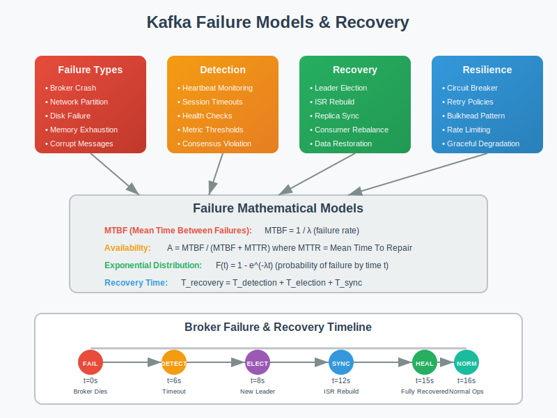

# Failure Models: Kafka Reliability Analysis



## Overview

This section analyzes failure scenarios in Kafka deployments and provides mathematical models for understanding system behavior under various fault conditions. Understanding failure modes is crucial for building resilient streaming architectures.

## Types of Failures in Kafka

### 1. Broker Failures
- **Single Broker Failure**: One broker becomes unavailable
- **Multiple Broker Failures**: Multiple brokers fail simultaneously
- **Network Partitions**: Brokers lose connectivity to each other
- **Cascading Failures**: One failure triggers additional failures

### 2. Client Failures
- **Producer Failures**: Producer applications crash or become unresponsive
- **Consumer Failures**: Consumer applications fail or lag significantly
- **Consumer Group Failures**: Entire consumer groups become unavailable

### 3. Infrastructure Failures
- **Network Failures**: Packet loss, high latency, or disconnections
- **Storage Failures**: Disk corruption, full disks, or I/O errors
- **Resource Exhaustion**: CPU, memory, or file descriptor limits

## Mathematical Models for Failure Analysis

### Availability Calculation
```
Single Broker Availability = MTBF / (MTBF + MTTR)

where:
- MTBF = Mean Time Between Failures
- MTTR = Mean Time To Recovery

Cluster Availability = 1 - (1 - Broker_Availability)^Replication_Factor

For replication factor 3:
Cluster_Availability = 1 - (1 - 0.99)^3 = 1 - 0.000001 = 99.9999%
```

### Data Loss Probability
```
Data Loss Probability = P(>F failures before acknowledgment)

For replication factor R and F simultaneous failures:
P(Data Loss) = C(R,F) × (failure_rate)^F × (1-failure_rate)^(R-F)

Example with R=3, typical failure_rate=0.001:
P(2+ failures) = C(3,2)×(0.001)^2×(0.999)^1 + C(3,3)×(0.001)^3×(0.999)^0
                = 3×0.000001×0.999 + 1×0.000000001×1
                ≈ 0.000003 (extremely low)
```

### Recovery Time Analysis
```
Recovery Time = Detection Time + Election Time + Sync Time + Client Reconnect Time

Detection Time = Heartbeat Interval × Failure Detection Multiplier
Election Time = Network Round Trip × Log(Brokers)  
Sync Time = (Log Size × Catch-up Factor) / Network Bandwidth
Client Reconnect = Connection Timeout + Backoff Time
```

## Failure Scenarios and Impact Analysis

### Scenario 1: Single Broker Failure

**Setup**: 3-broker cluster, replication factor 2
- Topic: user-events (6 partitions)
- Producer: 10,000 messages/second
- Consumer group: 3 consumers

**Failure Impact**:
```
Before Failure:
- Partitions 0,1: Replicas on brokers [1,2]
- Partitions 2,3: Replicas on brokers [2,3]  
- Partitions 4,5: Replicas on brokers [1,3]

After Broker 1 Fails:
- Partitions 0,1: Only replica on broker 2 (degraded)
- Partitions 2,3: Replicas on brokers [2,3] (unaffected)
- Partitions 4,5: Only replica on broker 3 (degraded)

Recovery Actions:
1. Detect failure (10-30 seconds)
2. Elect new leaders for partitions 0,1,4,5
3. Start replication to restore replication factor
```

**Mathematical Analysis**:
```
Available Capacity: 66% (4 out of 6 partitions fully replicated)
Recovery Time: ~5 minutes for full replication restoration
Message Loss Risk: Zero (with acks=all configuration)
```

### Scenario 2: Network Partition (Split Brain)

**Setup**: 5-broker cluster split into groups [1,2] and [3,4,5]

**Partition Analysis**:
```
Group A [1,2]: 2 brokers (minority)
Group B [3,4,5]: 3 brokers (majority)

Quorum Requirement: (5/2) + 1 = 3 brokers

Result: Only Group B can accept writes
Group A: Read-only mode (prevents split-brain)
```

**Resolution Strategy**:
```python
def handle_network_partition(brokers, quorum_size):
    active_brokers = count_responsive_brokers(brokers)
    
    if active_brokers >= quorum_size:
        return "ACTIVE"  # Accept reads and writes
    else:
        return "READ_ONLY"  # Prevent split-brain
```

### Scenario 3: Consumer Group Failure

**Setup**: Consumer group with 4 consumers processing user-events topic

**Failure Sequence**:
```
Time 0: All 4 consumers processing normally
Time 1: Consumer C1 crashes
Time 2: Rebalancing triggered (30 seconds)
Time 3: Partitions redistributed among C2, C3, C4
Time 4: Consumer C2 becomes slow (lag increases)
Time 5: Consumer C3 and C4 crash simultaneously
Time 6: Critical failure - no consumers available
```

**Impact Calculation**:
```
Message Backlog = Production Rate × Downtime
Example: 1000 msg/sec × 300 seconds = 300,000 messages

Recovery Time = Consumer Restart + Catch-up Time
Catch-up Time = Message Backlog / Consumer Throughput
Example: 300,000 messages / 500 msg/sec = 600 seconds
```

## Failure Prevention Strategies

### 1. Replication Configuration
```
# Conservative approach for critical data
replication.factor=3
min.in.sync.replicas=2
acks=all

# Balanced approach
replication.factor=2
min.in.sync.replicas=1
acks=1

# Performance-optimized (higher risk)
replication.factor=1
acks=0
```

### 2. Producer Resilience
```java
// Producer configuration for fault tolerance
props.put(ProducerConfig.RETRIES_CONFIG, Integer.MAX_VALUE);
props.put(ProducerConfig.ENABLE_IDEMPOTENCE_CONFIG, true);
props.put(ProducerConfig.ACKS_CONFIG, "all");
props.put(ProducerConfig.MAX_IN_FLIGHT_REQUESTS_PER_CONNECTION, 1);

// Implement circuit breaker pattern
CircuitBreaker circuitBreaker = new CircuitBreaker(
    failureThreshold: 5,
    recoveryTimeout: 30000,
    retryTimeout: 10000
);
```

### 3. Consumer Resilience
```java
// Consumer configuration for reliability
props.put(ConsumerConfig.ENABLE_AUTO_COMMIT_CONFIG, false);
props.put(ConsumerConfig.AUTO_OFFSET_RESET_CONFIG, "earliest");
props.put(ConsumerConfig.SESSION_TIMEOUT_MS_CONFIG, 30000);
props.put(ConsumerConfig.HEARTBEAT_INTERVAL_MS_CONFIG, 3000);

// Manual offset management
while (true) {
    ConsumerRecords<String, String> records = consumer.poll(Duration.ofMillis(1000));
    
    for (ConsumerRecord<String, String> record : records) {
        try {
            processMessage(record);
            consumer.commitSync(Collections.singletonMap(
                new TopicPartition(record.topic(), record.partition()),
                new OffsetAndMetadata(record.offset() + 1)
            ));
        } catch (Exception e) {
            // Handle processing failure
            handleProcessingError(record, e);
        }
    }
}
```

## Monitoring and Alerting for Failure Detection

### Key Metrics to Monitor
```
# Broker Health
UnderReplicatedPartitions: Should be 0
OfflinePartitionsCount: Should be 0
LeaderElectionRateAndTimeMs: Spike indicates issues

# Producer Health  
RecordSendRate: Should match expected rate
RecordErrorRate: Should be minimal
BatchSizeAvg: Monitor for efficiency

# Consumer Health
ConsumerLag: Should be bounded
ConsumerLagSum: Total lag across all partitions
RecordsConsumedRate: Should match production rate
```

### Alert Thresholds
```python
def calculate_alert_thresholds():
    return {
        # Critical alerts
        'offline_partitions': 0,           # Any offline partition is critical
        'under_replicated_partitions': 5,  # Alert if > 5 partitions under-replicated
        'consumer_lag_critical': 100000,   # Critical if lag > 100k messages
        
        # Warning alerts  
        'consumer_lag_warning': 10000,     # Warning if lag > 10k messages
        'leader_election_rate': 5,         # More than 5 elections per hour
        'disk_usage_warning': 0.85,        # 85% disk utilization
        
        # Performance alerts
        'low_throughput': 0.7,             # 70% of expected throughput
        'high_latency_p99': 1000,          # 99th percentile > 1 second
        'error_rate_threshold': 0.01       # 1% error rate
    }
```

## Disaster Recovery Procedures

### Complete Cluster Failure Recovery
```
1. Data Assessment
   - Identify surviving brokers
   - Check log integrity
   - Assess data loss scope

2. Broker Recovery Sequence
   - Start brokers with cleanest logs first
   - Allow leader election to complete
   - Verify partition assignments

3. Client Recovery
   - Restart producers with latest offsets
   - Restart consumers from last committed offsets
   - Monitor for duplicate processing

4. Data Integrity Verification
   - Compare producer and consumer counts
   - Verify critical business metrics
   - Run data consistency checks
```

### Cross-Region Failover
```
Primary Region Failure:
1. Stop accepting writes in primary region
2. Promote secondary region to primary
3. Update DNS/load balancer routing
4. Start producers in new primary region
5. Monitor for split-brain scenarios

Recovery Time Objective (RTO): < 5 minutes
Recovery Point Objective (RPO): < 30 seconds of data loss
```

## Testing Failure Scenarios

### Chaos Engineering Approaches
```python
# Broker failure simulation
def simulate_broker_failure(cluster, broker_id, duration_seconds):
    cluster.stop_broker(broker_id)
    time.sleep(duration_seconds)
    cluster.start_broker(broker_id)
    
    return measure_recovery_metrics()

# Network partition simulation  
def simulate_network_partition(brokers_group_a, brokers_group_b, duration):
    network.block_communication(brokers_group_a, brokers_group_b)
    time.sleep(duration)
    network.restore_communication()
    
    return analyze_partition_behavior()

# Consumer failure simulation
def simulate_consumer_failure(consumer_group, failure_percentage):
    consumers_to_fail = select_random_consumers(consumer_group, failure_percentage)
    
    for consumer in consumers_to_fail:
        consumer.simulate_crash()
    
    return measure_rebalancing_impact()
```

### Failure Recovery Validation
```
Test Scenarios:
1. Single broker failure during peak load
2. Multiple broker failures in succession  
3. Network partition with minority/majority splits
4. Consumer group complete failure
5. Producer failure with message backlog
6. Disk failure on broker with critical partitions

Success Criteria:
- Zero message loss with acks=all
- Recovery within RTO/RPO targets
- No split-brain scenarios
- Consumer lag recovery within SLA
- Producer throughput restoration
```

## Next Steps

- **05-experiments/**: Implement failure testing scenarios
- **06-references/**: Research papers on distributed system failures  
- **07-use-cases/**: Apply failure models to real-world scenarios