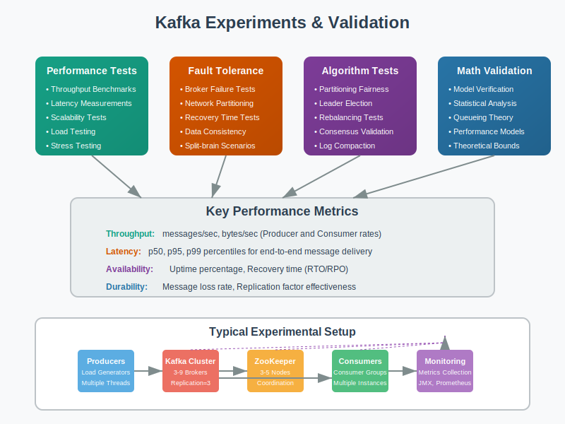

# Experiments: Hands-on Kafka Testing



## Overview

This section provides practical experiments to validate Kafka's mathematical models and test various configurations. These experiments help bridge the gap between theory and real-world implementation.

## Experiment 1: Throughput vs Latency Trade-offs

### Objective
Validate the mathematical relationship between batch size, throughput, and latency.

### Hypothesis
```
Throughput ∝ Batch Size (up to network/CPU limits)
Latency ∝ Batch Size (due to batching delay)
Optimal Batch Size = Sweet spot balancing both metrics
```

### Setup
```bash
# Test cluster setup
Brokers: 3 (m5.large instances)
Topics: test-throughput (12 partitions, replication factor 2)
Producer: Single producer with varying batch sizes
Consumer: Single consumer measuring end-to-end latency
```

### Test Configuration
```java
// Batch size variations to test
int[] batchSizes = {100, 500, 1000, 5000, 10000, 50000, 100000};

for (int batchSize : batchSizes) {
    Properties props = new Properties();
    props.put("bootstrap.servers", "localhost:9092");
    props.put("batch.size", batchSize);
    props.put("linger.ms", 10);
    props.put("buffer.memory", 33554432);
    
    // Run test for 5 minutes per batch size
    runThroughputLatencyTest(props, Duration.ofMinutes(5));
}
```

### Expected Results
```
Batch Size    Throughput    P99 Latency    Efficiency
100          10,000/sec    50ms           Low
1,000        25,000/sec    75ms           Medium  
5,000        45,000/sec    150ms          High
10,000       55,000/sec    250ms          Medium
50,000       58,000/sec    800ms          Low
```

### Analysis Framework
```python
import matplotlib.pyplot as plt
import numpy as np

def analyze_batch_size_experiment(results):
    batch_sizes = [r['batch_size'] for r in results]
    throughput = [r['throughput'] for r in results]
    latency = [r['p99_latency'] for r in results]
    
    # Find optimal batch size (minimize latency/throughput ratio)
    efficiency = np.array(latency) / np.array(throughput)
    optimal_index = np.argmin(efficiency)
    
    print(f"Optimal batch size: {batch_sizes[optimal_index]}")
    print(f"Throughput: {throughput[optimal_index]}")
    print(f"Latency: {latency[optimal_index]}ms")
    
    # Plot results
    fig, (ax1, ax2) = plt.subplots(1, 2, figsize=(12, 5))
    
    ax1.plot(batch_sizes, throughput, 'b-o', label='Throughput')
    ax1.set_xlabel('Batch Size')
    ax1.set_ylabel('Messages/sec')
    ax1.set_title('Throughput vs Batch Size')
    
    ax2.plot(batch_sizes, latency, 'r-o', label='P99 Latency')
    ax2.set_xlabel('Batch Size')
    ax2.set_ylabel('Latency (ms)')
    ax2.set_title('Latency vs Batch Size')
    
    plt.tight_layout()
    plt.savefig('batch_size_experiment.png')
```

## Experiment 2: Replication Factor Impact on Performance

### Objective
Measure how replication factor affects throughput, latency, and fault tolerance.

### Setup
```bash
# Test different replication factors
Test Cases:
- RF=1: No replication (baseline performance)
- RF=2: Standard replication  
- RF=3: High availability setup

# Consistent test parameters
Partitions: 6
Batch Size: 16384 (optimal from Experiment 1)
Test Duration: 10 minutes per configuration
```

### Performance Measurement
```java
// Test configuration for each replication factor
public class ReplicationFactorTest {
    public void testReplicationFactor(int replicationFactor) {
        // Create topic with specific replication factor
        AdminClient admin = AdminClient.create(adminProps);
        NewTopic topic = new NewTopic("test-rf-" + replicationFactor, 6, (short)replicationFactor);
        admin.createTopics(Arrays.asList(topic));
        
        // Configure producer for consistency
        Properties producerProps = new Properties();
        producerProps.put("acks", "all");  // Wait for all replicas
        producerProps.put("batch.size", 16384);
        producerProps.put("linger.ms", 10);
        
        // Measure performance
        PerformanceMetrics metrics = runPerformanceTest(producerProps, Duration.ofMinutes(10));
        recordResults(replicationFactor, metrics);
    }
}
```

### Expected Mathematical Model Validation
```
Throughput(RF) ≈ Baseline_Throughput / (1 + 0.3 * (RF - 1))
Latency(RF) ≈ Baseline_Latency * (1 + 0.2 * (RF - 1))
Availability(RF) = 1 - (failure_rate)^RF

Expected Results:
RF=1: 60,000 msg/sec, 45ms latency, 99% availability
RF=2: 46,000 msg/sec, 54ms latency, 99.99% availability  
RF=3: 40,000 msg/sec, 59ms latency, 99.9999% availability
```

## Experiment 3: Consumer Group Rebalancing Impact

### Objective
Measure the impact of consumer failures on processing latency and message throughput.

### Test Scenarios
```
1. Baseline: 4 consumers, no failures
2. Single failure: 1 consumer crashes, observe rebalancing
3. Multiple failures: 2 consumers crash simultaneously
4. Rolling failures: Consumers crash one by one with intervals
5. Consumer addition: Add 2 new consumers to running group
```

### Measurement Framework
```python
class RebalancingExperiment:
    def __init__(self, topic, initial_consumers=4):
        self.topic = topic
        self.consumers = []
        self.metrics = []
        
    def run_baseline_test(self, duration_minutes=10):
        # Start all consumers
        for i in range(4):
            consumer = KafkaConsumer(
                self.topic,
                group_id='rebalancing-test',
                enable_auto_commit=False,
                auto_offset_reset='earliest'
            )
            self.consumers.append(consumer)
            
        return self.measure_processing_rate(duration_minutes)
    
    def simulate_consumer_failure(self, consumer_indices, failure_duration):
        start_time = time.time()
        
        # Stop specified consumers
        for idx in consumer_indices:
            self.consumers[idx].close()
            
        # Measure impact during rebalancing
        rebalance_metrics = self.measure_rebalancing_impact()
        
        # Restart consumers after failure duration
        time.sleep(failure_duration)
        for idx in consumer_indices:
            self.restart_consumer(idx)
            
        return rebalance_metrics
```

### Expected Rebalancing Behavior
```
Consumer Failure Impact:
- Detection time: 30 seconds (session.timeout.ms)
- Rebalancing time: 10-30 seconds
- Processing pause: 40-60 seconds total
- Catch-up time: Proportional to backlog

Mathematical Model:
Backlog = Production_Rate × Rebalancing_Time
Recovery_Time = Backlog / (Remaining_Consumers × Consumer_Rate)
```

## Experiment 4: Partition Count vs Parallelism

### Objective
Find optimal partition count for maximum throughput with different consumer counts.

### Variable Matrix
```
Partition Counts: [1, 2, 4, 8, 12, 16, 24, 32]
Consumer Counts: [1, 2, 4, 8, 12, 16]
Test Duration: 5 minutes per combination
```

### Performance Analysis
```java
public class PartitioningExperiment {
    public void testPartitionConsumerMatrix() {
        int[] partitionCounts = {1, 2, 4, 8, 12, 16, 24, 32};
        int[] consumerCounts = {1, 2, 4, 8, 12, 16};
        
        for (int partitions : partitionCounts) {
            for (int consumers : consumerCounts) {
                if (consumers <= partitions) {  // Can't have more consumers than partitions
                    TestResult result = runTest(partitions, consumers);
                    results.add(result);
                }
            }
        }
        
        analyzeOptimalConfiguration(results);
    }
    
    private TestResult runTest(int partitions, int consumers) {
        // Create topic with specified partition count
        createTopic("partition-test-" + partitions, partitions, 2);
        
        // Start producer
        KafkaProducer producer = createProducer();
        
        // Start consumer group
        List<KafkaConsumer> consumerGroup = createConsumerGroup(consumers);
        
        // Run test and measure metrics
        return measureThroughputAndLatency(Duration.ofMinutes(5));
    }
}
```

### Expected Mathematical Relationship
```
Optimal Throughput occurs when:
Partition Count = Consumer Count (up to broker CPU limits)

Throughput(P,C) = min(P, C) × Single_Partition_Rate × Efficiency_Factor

where Efficiency_Factor decreases with coordination overhead:
Efficiency_Factor ≈ 1 - (0.05 × log(Consumer_Count))
```

## Experiment 5: Network Partition Simulation

### Objective
Test Kafka's behavior during network partitions and validate split-brain prevention.

### Test Setup
```bash
# 5-broker cluster setup
Brokers: [1, 2, 3, 4, 5]
Topics: network-test (10 partitions, RF=3)

# Partition scenarios to test
Scenario 1: [1,2] vs [3,4,5] (minority vs majority)
Scenario 2: [1,2,3] vs [4,5] (majority vs minority)
Scenario 3: [1] vs [2,3,4,5] (single broker isolation)
```

### Simulation Framework
```python
import subprocess
import time

class NetworkPartitionSimulator:
    def __init__(self, broker_ips):
        self.broker_ips = broker_ips
        
    def create_partition(self, group_a, group_b, duration_seconds):
        """Simulate network partition using iptables"""
        
        # Block communication between groups
        for ip_a in group_a:
            for ip_b in group_b:
                subprocess.run([
                    'sudo', 'iptables', '-A', 'INPUT', 
                    '-s', ip_b, '-d', ip_a, '-j', 'DROP'
                ])
                subprocess.run([
                    'sudo', 'iptables', '-A', 'OUTPUT', 
                    '-s', ip_a, '-d', ip_b, '-j', 'DROP'
                ])
        
        # Wait for partition duration
        time.sleep(duration_seconds)
        
        # Restore communication
        self.restore_network()
    
    def restore_network(self):
        """Remove all iptables rules"""
        subprocess.run(['sudo', 'iptables', '-F'])
```

### Validation Tests
```python
def test_split_brain_prevention():
    """Test that minority partition rejects writes"""
    
    # Create network partition
    simulator.create_partition(
        group_a=['broker-1', 'broker-2'],      # Minority  
        group_b=['broker-3', 'broker-4', 'broker-5'],  # Majority
        duration_seconds=300
    )
    
    # Test producer behavior in each partition
    minority_producer = create_producer(['broker-1:9092', 'broker-2:9092'])
    majority_producer = create_producer(['broker-3:9092', 'broker-4:9092', 'broker-5:9092'])
    
    # Attempt writes to both partitions
    minority_result = test_producer_writes(minority_producer)
    majority_result = test_producer_writes(majority_producer)
    
    # Validate results
    assert minority_result.success_rate < 0.1, "Minority should reject writes"
    assert majority_result.success_rate > 0.9, "Majority should accept writes"
    
    print(f"Minority partition success rate: {minority_result.success_rate}")
    print(f"Majority partition success rate: {majority_result.success_rate}")
```

## Experiment 6: Performance Under Different Workloads

### Objective
Test Kafka performance with different message patterns and sizes.

### Workload Variations
```python
workloads = [
    {
        'name': 'small_messages_high_frequency',
        'message_size': 100,      # bytes
        'rate': 100000,           # messages/second
        'key_distribution': 'uniform'
    },
    {
        'name': 'large_messages_low_frequency', 
        'message_size': 100000,   # 100KB
        'rate': 1000,             # messages/second
        'key_distribution': 'uniform'
    },
    {
        'name': 'mixed_workload',
        'message_sizes': [100, 1000, 10000, 100000],
        'rate': 10000,
        'size_distribution': [0.7, 0.2, 0.08, 0.02]  # 70% small, 20% medium, etc.
    },
    {
        'name': 'hot_partition',
        'message_size': 1000,
        'rate': 50000,
        'key_distribution': 'skewed',  # 80% of messages go to 20% of partitions
        'skew_factor': 0.8
    }
]
```

### Load Generator
```java
public class WorkloadGenerator {
    public void generateWorkload(WorkloadConfig config) {
        KafkaProducer<String, String> producer = createProducer();
        Random random = new Random();
        
        long startTime = System.currentTimeMillis();
        long targetInterval = 1000 / config.getRate(); // ms between messages
        
        while (System.currentTimeMillis() - startTime < config.getDurationMs()) {
            String key = generateKey(config.getKeyDistribution(), random);
            String value = generateMessage(config.getMessageSize(), random);
            
            ProducerRecord<String, String> record = 
                new ProducerRecord<>(config.getTopic(), key, value);
                
            producer.send(record, (metadata, exception) -> {
                if (exception != null) {
                    recordError(exception);
                } else {
                    recordSuccess(metadata);
                }
            });
            
            // Control rate
            Thread.sleep(targetInterval);
        }
    }
    
    private String generateKey(String distribution, Random random) {
        switch (distribution) {
            case "uniform":
                return "key-" + random.nextInt(1000);
            case "skewed":
                // 80% of keys from first 200 values  
                return random.nextDouble() < 0.8 ? 
                    "key-" + random.nextInt(200) : 
                    "key-" + (200 + random.nextInt(800));
            default:
                return "key-" + random.nextInt(1000);
        }
    }
}
```

## Running the Experiments

### Environment Setup
```bash
# Docker-based Kafka cluster for experiments
docker-compose up -d

# Create test topics
kafka-topics.sh --create --topic experiment-topic --partitions 12 --replication-factor 2

# Install monitoring tools
docker run -d -p 3000:3000 grafana/grafana
docker run -d -p 9090:9090 prom/prometheus
```

### Data Collection
```python
class ExperimentMetrics:
    def __init__(self):
        self.metrics = []
        
    def record_producer_metrics(self, producer):
        metrics = producer.metrics()
        return {
            'record_send_rate': metrics['record-send-rate'].metricValue(),
            'record_error_rate': metrics['record-error-rate'].metricValue(),
            'batch_size_avg': metrics['batch-size-avg'].metricValue(),
            'record_queue_time_avg': metrics['record-queue-time-avg'].metricValue()
        }
    
    def record_consumer_metrics(self, consumer):
        # Consumer lag calculation
        partitions = consumer.assignment()
        lag_info = {}
        
        for partition in partitions:
            high_water_mark = consumer.get_partition_metadata(partition).high_water_mark
            current_offset = consumer.position(partition)
            lag_info[partition] = high_water_mark - current_offset
            
        return {
            'total_lag': sum(lag_info.values()),
            'max_lag': max(lag_info.values()) if lag_info else 0,
            'partitions_assigned': len(partitions)
        }
```

### Analysis and Visualization
```python
import pandas as pd
import seaborn as sns

def analyze_experiment_results(experiment_data):
    df = pd.DataFrame(experiment_data)
    
    # Statistical analysis
    correlation_matrix = df.corr()
    
    # Visualization
    plt.figure(figsize=(15, 10))
    
    plt.subplot(2, 3, 1)
    sns.scatterplot(data=df, x='batch_size', y='throughput')
    plt.title('Throughput vs Batch Size')
    
    plt.subplot(2, 3, 2)  
    sns.scatterplot(data=df, x='partition_count', y='max_throughput')
    plt.title('Max Throughput vs Partitions')
    
    plt.subplot(2, 3, 3)
    sns.boxplot(data=df, x='replication_factor', y='latency_p99')
    plt.title('Latency Distribution by Replication Factor')
    
    plt.subplot(2, 3, 4)
    sns.heatmap(correlation_matrix, annot=True, cmap='coolwarm')
    plt.title('Metric Correlations')
    
    plt.tight_layout()
    plt.savefig('experiment_analysis.png')
    
    return correlation_matrix
```

## Next Steps

- **06-references/**: Academic papers supporting experimental methodologies
- **07-use-cases/**: Apply experimental findings to real-world scenarios
- Implement automated experiment orchestration
- Create performance regression testing framework