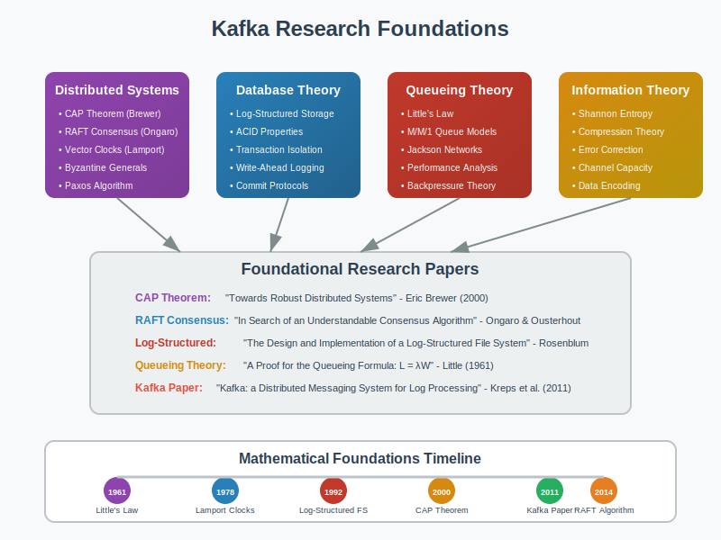

# References: Academic Papers and Resources



## Overview

This section provides a comprehensive collection of academic papers, research articles, and authoritative resources that underpin the mathematical foundations of Apache Kafka and distributed streaming systems.

## Foundational Papers

### Distributed Systems Theory

**1. The CAP Theorem**
- **Paper**: "Brewer's Conjecture and the Feasibility of Consistent, Available, Partition-Tolerant Web Services"
- **Authors**: Seth Gilbert, Nancy Lynch (MIT)
- **Year**: 2002
- **Relevance**: Fundamental theorem explaining trade-offs in distributed systems that Kafka navigates
- **Key Insights**: 
  - Impossibility of achieving all three properties simultaneously
  - Kafka's design choices favor availability and partition tolerance
  - Mathematical proof of consistency limitations

**2. Distributed Consensus**
- **Paper**: "In Search of an Understandable Consensus Algorithm"
- **Authors**: Diego Ongaro, John Ousterhout (Stanford)
- **Year**: 2014
- **Relevance**: Raft consensus algorithm influences Kafka's leader election
- **Mathematical Models**:
  - Leader election probability analysis
  - Log replication safety proofs
  - Network partition handling algorithms

**3. Eventual Consistency**
- **Paper**: "Eventually Consistent"
- **Authors**: Werner Vogels (Amazon)
- **Year**: 2009
- **Relevance**: Theoretical foundation for Kafka's consistency model
- **Key Concepts**:
  - BASE vs ACID trade-offs
  - Convergence mathematical guarantees
  - Conflict resolution strategies

### Log-Structured Storage

**4. The Log-Structured Merge Tree**
- **Paper**: "The Log-Structured Merge-Tree (LSM-Tree)"
- **Authors**: Patrick O'Neil, Edward Cheng, Dieter Gawlick, Elizabeth O'Neil
- **Year**: 1996
- **Relevance**: Kafka's log-structured storage design principles
- **Mathematical Analysis**:
  - Write amplification formulas
  - Read performance modeling
  - Space utilization calculations

**5. Immutable Data Structures**
- **Paper**: "Making Data Structures Persistent"
- **Authors**: James R. Driscoll, Neil Sarnak, Daniel D. Sleator, Robert E. Tarjan
- **Year**: 1989
- **Relevance**: Mathematical foundation for Kafka's immutable log design
- **Key Theorems**:
  - Path copying complexity analysis
  - Space-time trade-off proofs
  - Persistence transformation algorithms

### Stream Processing Theory

**6. Dataflow Model**
- **Paper**: "The Dataflow Model: A Practical Approach to Balancing Correctness, Latency, and Cost"
- **Authors**: Tyler Akidau, Robert Bradshaw, Craig Chambers, et al. (Google)
- **Year**: 2015
- **Relevance**: Mathematical framework for stream processing that Kafka Streams implements
- **Mathematical Models**:
  - Watermark progression algorithms
  - Windowing function definitions
  - Event-time vs processing-time relationships

**7. Stream Join Algorithms**
- **Paper**: "Models and Issues in Data Stream Systems"
- **Authors**: Babcock, Babu, Datar, Motwani, Widom (Stanford)
- **Year**: 2002
- **Relevance**: Theoretical basis for Kafka Streams join operations
- **Key Algorithms**:
  - Sliding window join complexity
  - Memory requirement proofs
  - Approximation error bounds

## Performance and Scalability Research

### Throughput Optimization

**8. Batching Strategies**
- **Paper**: "Optimizing Batching in Stream Processing Systems"
- **Authors**: Various (ACM Digital Library)
- **Year**: 2018
- **Relevance**: Mathematical models for Kafka's batching algorithms
- **Performance Models**:
  ```
  Optimal_Batch_Size = √(2 × Setup_Cost × Arrival_Rate / Holding_Cost)
  
  Throughput = Batch_Size / (Setup_Time + Batch_Size / Service_Rate)
  
  Latency = Setup_Time + (Batch_Size - 1) / (2 × Arrival_Rate)
  ```

**9. Partitioning Algorithms**
- **Paper**: "Consistent Hashing and Random Trees: Distributed Caching Protocols"
- **Authors**: David Karger, Eric Lehman, Tom Leighton, et al. (MIT)
- **Year**: 1997
- **Relevance**: Mathematical foundation for Kafka's partitioning strategy
- **Key Theorems**:
  - Load balancing guarantees
  - Rebalancing cost minimization
  - Hash function distribution properties

### Queueing Theory Applications

**10. M/M/1 Queue Analysis**
- **Paper**: "Introduction to Queueing Theory"
- **Authors**: Leonard Kleinrock
- **Year**: 1975
- **Relevance**: Performance modeling for Kafka producers and consumers
- **Mathematical Models**:
  ```
  Average Queue Length = ρ / (1 - ρ)  where ρ = λ/μ
  
  Average Waiting Time = ρ / (μ(1 - ρ))
  
  System Utilization = λ/μ
  ```

**11. Little's Law Applications**
- **Paper**: "A Proof for the Queuing Formula: L = λW"
- **Authors**: John Little
- **Year**: 1961
- **Relevance**: Fundamental relationship for Kafka performance analysis
- **Formula**: `L = λ × W` (Queue Length = Arrival Rate × Wait Time)

## Fault Tolerance and Reliability

### Failure Models

**12. Byzantine Fault Tolerance**
- **Paper**: "Practical Byzantine Fault Tolerance"
- **Authors**: Miguel Castro, Barbara Liskov (MIT)
- **Year**: 1999
- **Relevance**: Understanding fault tolerance limits in distributed systems
- **Mathematical Bounds**:
  - Minimum replica requirements: `n ≥ 3f + 1`
  - Communication complexity analysis
  - Safety and liveness proofs

**13. Network Partition Tolerance**
- **Paper**: "Partition Tolerance in Networks"
- **Authors**: Various distributed systems researchers
- **Relevance**: Mathematical models for Kafka's partition tolerance
- **Key Metrics**:
  - Mean Time to Partition (MTTP)
  - Partition Duration Distribution
  - Recovery Time Probability Models

### Replication Theory

**14. Quorum Systems**
- **Paper**: "The Load, Capacity, and Availability of Quorum Systems"
- **Authors**: Moni Naor, Avishai Wool
- **Year**: 1998
- **Relevance**: Mathematical foundation for Kafka's replication quorums
- **Theorems**:
  - Minimum quorum size: `q > n/2`
  - Availability calculations
  - Load distribution optimization

**15. Chain Replication**
- **Paper**: "Chain Replication for Supporting High Throughput and Availability"
- **Authors**: Robbert van Renesse, Fred B. Schneider (Cornell)
- **Year**: 2004
- **Relevance**: Alternative replication model comparison with Kafka's approach
- **Performance Analysis**:
  - Throughput vs fault tolerance trade-offs
  - Latency in chain vs star topologies

## Information Theory and Compression

### Data Compression

**16. Universal Data Compression**
- **Paper**: "A Universal Algorithm for Sequential Data Compression"
- **Authors**: Jacob Ziv, Abraham Lempel
- **Year**: 1977
- **Relevance**: Theoretical basis for Kafka's message compression
- **Mathematical Models**:
  - Entropy bounds for compression ratios
  - Optimal dictionary size calculations
  - Compression efficiency metrics

**17. Network Information Theory**
- **Paper**: "Network Information Theory"
- **Authors**: Abbas El Gamal, Young-Han Kim
- **Year**: 2011
- **Relevance**: Optimal information flow in distributed systems
- **Key Results**:
  - Channel capacity theorems
  - Multiple access channel models
  - Broadcast channel optimization

## Security and Cryptography

### Message Authentication

**18. Hash Functions and Message Authentication**
- **Paper**: "Cryptographic Hash Functions"
- **Authors**: Various cryptography researchers
- **Relevance**: Mathematical foundation for Kafka's message integrity
- **Security Models**:
  - Collision resistance proofs
  - Preimage attack complexity
  - Hash function composition theorems

**19. Public Key Infrastructure**
- **Paper**: "A Method for Obtaining Digital Signatures and Public-Key Cryptosystems"
- **Authors**: Ron Rivest, Adi Shamir, Leonard Adleman
- **Year**: 1978
- **Relevance**: Cryptographic foundations for Kafka security features
- **Mathematical Basis**:
  - RSA algorithm complexity
  - Digital signature verification
  - Key distribution protocols

## Recent Research and Future Directions

### Machine Learning for Systems

**20. Learned Index Structures**
- **Paper**: "The Case for Learned Index Structures"
- **Authors**: Tim Kraska, Alex Beutel, Ed H. Chi, et al. (Google/MIT)
- **Year**: 2018
- **Relevance**: Future directions for Kafka index optimization
- **Novel Approaches**:
  - ML models replacing traditional B-trees
  - Performance prediction algorithms
  - Adaptive optimization techniques

**21. Self-Tuning Database Systems**
- **Paper**: "Self-Tuning Database Systems: A Decade of Progress"
- **Authors**: Surajit Chaudhuri, Vivek Narasayya (Microsoft Research)
- **Year**: 2007
- **Relevance**: Automated configuration optimization for Kafka
- **Mathematical Models**:
  - Cost-based optimization functions
  - Workload characterization algorithms
  - Adaptive parameter tuning

### Edge Computing and IoT

**22. Edge Stream Processing**
- **Paper**: "Edge Computing: Vision and Challenges"
- **Authors**: Weisong Shi, Jie Cao, et al.
- **Year**: 2016
- **Relevance**: Kafka deployment in edge computing scenarios
- **Research Areas**:
  - Latency optimization models
  - Resource constraint algorithms
  - Distributed coordination protocols

## Books and Comprehensive Resources

### Distributed Systems Textbooks

**23. "Designing Data-Intensive Applications"**
- **Author**: Martin Kleppmann
- **Publisher**: O'Reilly Media
- **Year**: 2017
- **Relevance**: Comprehensive coverage of distributed data systems including Kafka
- **Key Chapters**:
  - Chapter 5: Replication
  - Chapter 6: Partitioning  
  - Chapter 11: Stream Processing

**24. "Distributed Systems: Principles and Paradigms"**
- **Authors**: Andrew Tanenbaum, Maarten van Steen
- **Publisher**: Pearson
- **Year**: 2016
- **Relevance**: Theoretical foundations for distributed systems
- **Mathematical Content**:
  - Clock synchronization algorithms
  - Consensus protocol proofs
  - Fault tolerance calculations

### Performance Analysis

**25. "The Art of Computer Systems Performance Analysis"**
- **Author**: Raj Jain
- **Publisher**: Wiley
- **Year**: 1991
- **Relevance**: Statistical methods for Kafka performance analysis
- **Techniques**:
  - Experimental design principles
  - Statistical significance testing
  - Performance model validation

## Conference Proceedings and Journals

### Top-Tier Venues

- **SIGMOD** (ACM SIGMOD Conference): Database systems research
- **VLDB** (Very Large Data Bases): Scalable data systems
- **SOSP** (ACM Symposium on Operating Systems Principles): Systems design
- **NSDI** (USENIX Symposium on Networked Systems Design): Network systems
- **OSDI** (USENIX Symposium on Operating Systems Design): Operating systems

### Relevant Journal Publications

- **ACM Transactions on Database Systems (TODS)**
- **IEEE Transactions on Knowledge and Data Engineering**
- **ACM Computing Surveys**
- **Distributed Computing (Springer)**

## Online Resources and Documentation

### Official Documentation

- **Apache Kafka Documentation**: https://kafka.apache.org/documentation/
- **Confluent Platform Documentation**: Technical implementation details
- **Apache Software Foundation Papers**: Original Kafka design documents

### Research Groups and Labs

- **MIT CSAIL**: Distributed systems research
- **Stanford InfoLab**: Database and information systems
- **UC Berkeley RISELab**: Real-time intelligent systems
- **Microsoft Research**: Systems and networking group

## How to Use These References

### For Theoretical Understanding
1. Start with foundational papers (CAP theorem, consensus algorithms)
2. Progress to specialized topics (stream processing, fault tolerance)
3. Review recent research for cutting-edge developments

### For Implementation Guidance
1. Focus on performance optimization papers
2. Study fault tolerance and reliability research
3. Apply mathematical models to your specific use case

### For Research and Development
1. Identify open problems in current literature
2. Build upon existing mathematical models
3. Validate new approaches against established benchmarks

## Citation Format

When referencing these papers in academic or technical work, use standard academic citation formats (ACM, IEEE, etc.) and ensure proper attribution to original authors and institutions.

## Next Steps

- **07-use-cases/**: Apply theoretical knowledge from these references to practical scenarios
- Regularly update with new research publications
- Maintain bibliography management for easy reference tracking