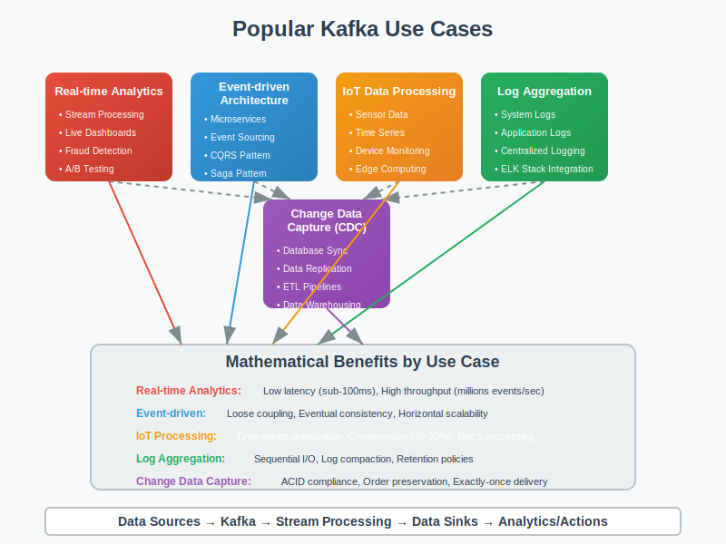

# Use Cases: Popular Kafka Implementation Patterns



## Overview

This section presents popular real-world Kafka use cases with simplified implementations and workflows. Each use case demonstrates practical applications of the mathematical concepts covered in previous sections.

## Use Case 1: Real-time Analytics Pipeline

### Business Scenario
**Company**: StreamCommerce Inc.  
**Challenge**: Process millions of user interactions in real-time to power recommendation engines and business dashboards.

### Architecture Overview
```
Web App → Kafka → [Stream Processing] → Analytics DB → Dashboard
    ↓
Mobile App → Kafka → [ML Pipeline] → Recommendation API
    ↓
IoT Sensors → Kafka → [Alerting System] → Notification Service
```

### Mathematical Foundation
- **Throughput Requirements**: 100,000 events/second peak
- **Latency SLA**: 95% of events processed within 100ms
- **Availability Target**: 99.99% uptime

### Implementation

#### Topic Design
```bash
# Create topics with optimal partitioning
kafka-topics.sh --create --topic user-clicks \
  --partitions 12 --replication-factor 3 \
  --config retention.ms=86400000  # 1 day retention

kafka-topics.sh --create --topic user-purchases \
  --partitions 6 --replication-factor 3 \
  --config retention.ms=604800000  # 7 days retention

kafka-topics.sh --create --topic sensor-data \
  --partitions 24 --replication-factor 2 \
  --config retention.ms=3600000   # 1 hour retention
```

#### Producer Configuration
```java
public class AnalyticsProducer {
    private KafkaProducer<String, String> producer;
    
    public AnalyticsProducer() {
        Properties props = new Properties();
        props.put("bootstrap.servers", "kafka-cluster:9092");
        props.put("key.serializer", "org.apache.kafka.common.serialization.StringSerializer");
        props.put("value.serializer", "org.apache.kafka.common.serialization.StringSerializer");
        
        // Optimized for high throughput
        props.put("batch.size", 16384);
        props.put("linger.ms", 10);
        props.put("buffer.memory", 33554432);
        props.put("compression.type", "lz4");
        
        // Reliability settings
        props.put("acks", "1");  // Balance between performance and durability
        props.put("retries", Integer.MAX_VALUE);
        props.put("enable.idempotence", true);
        
        this.producer = new KafkaProducer<>(props);
    }
    
    public void sendClickEvent(String userId, String productId, String action) {
        String key = userId;  // Partition by user for session affinity
        String value = createClickEvent(userId, productId, action);
        
        ProducerRecord<String, String> record = 
            new ProducerRecord<>("user-clicks", key, value);
            
        producer.send(record, (metadata, exception) -> {
            if (exception != null) {
                handleSendError(record, exception);
            }
        });
    }
}
```

#### Stream Processing with Kafka Streams
```java
public class RealTimeAnalytics {
    public static void main(String[] args) {
        StreamsBuilder builder = new StreamsBuilder();
        
        // Process click stream
        KStream<String, String> clicks = builder.stream("user-clicks");
        
        // Count clicks per user in 5-minute windows
        clicks
            .groupByKey()
            .windowedBy(TimeWindows.of(Duration.ofMinutes(5)))
            .count()
            .toStream()
            .to("user-activity-counts");
        
        // Calculate conversion rates
        KStream<String, String> purchases = builder.stream("user-purchases");
        
        // Join clicks with purchases within 1-hour window
        clicks.join(purchases,
            (clickValue, purchaseValue) -> createConversionEvent(clickValue, purchaseValue),
            JoinWindows.of(Duration.ofHours(1))
        ).to("conversion-events");
        
        // Start processing
        KafkaStreams streams = new KafkaStreams(builder.build(), getStreamsConfig());
        streams.start();
    }
}
```

### Performance Optimization

#### Mathematical Analysis
```
Target Throughput: 100,000 events/sec
Partition Count: 12 (user-clicks)
Per-Partition Rate: 100,000 / 12 ≈ 8,333 events/sec

Batch Efficiency:
Optimal Batch Size = √(2 × Network_RTT × Event_Rate / Holding_Cost)
                   = √(2 × 1ms × 8,333 / 0.1ms) ≈ 408 events

With 16KB batch size and 100-byte average event:
Events per Batch = 16,384 / 100 ≈ 164 events (suboptimal for latency)
Recommended: Reduce batch size to 4KB for better latency
```

#### Monitoring and Alerting
```java
public class AnalyticsMonitoring {
    private final MeterRegistry meterRegistry;
    
    public void recordMetrics(KafkaProducer producer, KafkaConsumer consumer) {
        // Producer metrics
        Timer.Sample sample = Timer.start(meterRegistry);
        producer.metrics().forEach((metricName, metric) -> {
            if (metricName.name().equals("record-send-rate")) {
                Gauge.builder("kafka.producer.send.rate")
                     .register(meterRegistry, metric::metricValue);
            }
        });
        
        // Consumer lag monitoring
        consumer.assignment().forEach(partition -> {
            long lag = getConsumerLag(consumer, partition);
            Gauge.builder("kafka.consumer.lag")
                 .tag("partition", partition.toString())
                 .register(meterRegistry, () -> lag);
                 
            if (lag > 10000) {  // Alert if lag > 10k messages
                alertingService.sendAlert("High consumer lag detected: " + lag);
            }
        });
    }
}
```

## Use Case 2: Event-Driven Microservices

### Business Scenario
**Company**: FinTech Solutions Ltd.  
**Challenge**: Build resilient payment processing system with event-driven architecture.

### Architecture Pattern
```
Payment API → payment-events → [Order Service]
                             → [Inventory Service] 
                             → [Notification Service]
                             → [Fraud Detection]
                             → [Analytics Service]
```

### Implementation

#### Event Schema Design
```json
{
  "payment_event": {
    "event_id": "uuid",
    "timestamp": "ISO8601",
    "event_type": "PAYMENT_INITIATED|PAYMENT_COMPLETED|PAYMENT_FAILED",
    "user_id": "string",
    "amount": "decimal",
    "currency": "string",
    "payment_method": "string",
    "merchant_id": "string",
    "correlation_id": "uuid"
  }
}
```

#### Saga Pattern Implementation
```java
@Component
public class PaymentSaga {
    
    @KafkaListener(topics = "payment-events")
    public void handlePaymentEvent(PaymentEvent event) {
        switch (event.getEventType()) {
            case PAYMENT_INITIATED:
                processPaymentInitiation(event);
                break;
            case PAYMENT_COMPLETED:
                completePaymentSaga(event);
                break;
            case PAYMENT_FAILED:
                rollbackPaymentSaga(event);
                break;
        }
    }
    
    private void processPaymentInitiation(PaymentEvent event) {
        try {
            // Step 1: Reserve inventory
            inventoryService.reserveItems(event.getOrderId());
            publishEvent("inventory-reserved", event);
            
            // Step 2: Charge payment
            paymentProcessor.chargePayment(event);
            publishEvent("payment-charged", event);
            
        } catch (Exception e) {
            publishEvent("payment-saga-failed", event);
            initiateCompensation(event);
        }
    }
    
    private void initiateCompensation(PaymentEvent event) {
        // Compensating transactions
        inventoryService.releaseReservation(event.getOrderId());
        paymentProcessor.refundPayment(event);
        notificationService.sendFailureNotification(event);
    }
}
```

#### Exactly-Once Semantics
```java
@Service
public class PaymentProcessor {
    private final KafkaTransactionManager transactionManager;
    
    @Transactional("kafkaTransactionManager")
    public void processPayment(PaymentEvent event) {
        // Idempotency check
        if (paymentRepository.existsByCorrelationId(event.getCorrelationId())) {
            log.info("Payment already processed: {}", event.getCorrelationId());
            return;  // Skip duplicate processing
        }
        
        try {
            // Business logic
            Payment payment = new Payment(event);
            Payment savedPayment = paymentRepository.save(payment);
            
            // Publish success event within transaction
            PaymentCompletedEvent successEvent = new PaymentCompletedEvent(savedPayment);
            kafkaTemplate.send("payment-completed", successEvent);
            
        } catch (Exception e) {
            // Transaction will rollback both DB and Kafka operations
            throw new PaymentProcessingException("Failed to process payment", e);
        }
    }
}
```

### Mathematical Reliability Analysis

#### Availability Calculation
```
Individual Service Availability: 99.9%
Number of Services in Chain: 5

Overall Saga Availability = (0.999)^5 = 0.995 = 99.5%

With Compensation Mechanisms:
Effective Availability = Base_Availability + (1 - Base_Availability) × Recovery_Rate
                      = 0.995 + (1 - 0.995) × 0.95
                      = 0.995 + 0.00475 = 99.975%
```

#### Performance Modeling
```
Expected Processing Time per Payment:
- Payment validation: 50ms
- Inventory check: 30ms  
- Payment processing: 200ms
- Event publishing: 10ms
- Total sequential time: 290ms

With parallel processing:
Parallel operations (inventory + fraud check): max(30ms, 80ms) = 80ms
Total optimized time: 50ms + 80ms + 200ms + 10ms = 340ms
```

## Use Case 3: IoT Data Ingestion and Processing

### Business Scenario
**Company**: SmartCity Technologies  
**Challenge**: Collect and process data from 10,000+ IoT sensors across the city for traffic management and environmental monitoring.

### Data Flow Architecture
```
IoT Sensors → Edge Gateway → Kafka → [Stream Processing] → Time Series DB
                                   → [ML Pipeline] → Prediction API
                                   → [Alert System] → Emergency Response
```

### Implementation

#### Sensor Data Schema
```json
{
  "sensor_reading": {
    "sensor_id": "string",
    "timestamp": "long",
    "location": {
      "latitude": "double",
      "longitude": "double"
    },
    "sensor_type": "TEMPERATURE|HUMIDITY|AIR_QUALITY|TRAFFIC",
    "value": "double",
    "unit": "string",
    "quality_score": "float"
  }
}
```

#### High-Throughput Producer (Edge Gateway)
```java
public class IoTDataGateway {
    private final KafkaProducer<String, SensorReading> producer;
    private final ScheduledExecutorService scheduler;
    
    public IoTDataGateway() {
        Properties props = new Properties();
        props.put("bootstrap.servers", "kafka-cluster:9092");
        props.put("key.serializer", StringSerializer.class.getName());
        props.put("value.serializer", "io.confluent.kafka.serializers.KafkaAvroSerializer");
        
        // Optimized for high-throughput IoT data
        props.put("batch.size", 65536);  // 64KB batches
        props.put("linger.ms", 50);      // 50ms batching window
        props.put("compression.type", "lz4");
        props.put("acks", "1");          // Performance over durability for sensor data
        
        this.producer = new KafkaProducer<>(props);
        this.scheduler = Executors.newScheduledThreadPool(10);
    }
    
    public void startDataCollection() {
        // Collect from 10,000 sensors every 30 seconds
        scheduler.scheduleAtFixedRate(() -> {
            collectSensorData();
        }, 0, 30, TimeUnit.SECONDS);
    }
    
    private void collectSensorData() {
        List<SensorReading> readings = sensorManager.readAllSensors();
        
        readings.parallelStream().forEach(reading -> {
            String partitionKey = reading.getSensorId(); // Partition by sensor
            ProducerRecord<String, SensorReading> record = 
                new ProducerRecord<>("sensor-data", partitionKey, reading);
                
            producer.send(record, (metadata, exception) -> {
                if (exception != null) {
                    handleSensorDataError(reading, exception);
                }
            });
        });
    }
}
```

#### Stream Processing for Anomaly Detection
```java
public class IoTStreamProcessor {
    public static void main(String[] args) {
        StreamsBuilder builder = new StreamsBuilder();
        
        KStream<String, SensorReading> sensorStream = builder.stream("sensor-data");
        
        // Group by sensor type and location
        KGroupedStream<String, SensorReading> groupedBySensor = 
            sensorStream.groupBy((key, value) -> value.getSensorType() + "-" + value.getLocationHash());
        
        // Calculate moving averages in 10-minute windows
        groupedBySensor
            .windowedBy(TimeWindows.of(Duration.ofMinutes(10)))
            .aggregate(
                SensorAggregation::new,
                (key, value, aggregate) -> aggregate.add(value),
                Materialized.with(Serdes.String(), new SensorAggregationSerde())
            )
            .toStream()
            .filter((key, aggregate) -> isAnomalous(aggregate))
            .to("sensor-anomalies");
        
        KafkaStreams streams = new KafkaStreams(builder.build(), getStreamsConfig());
        streams.start();
    }
    
    private static boolean isAnomalous(SensorAggregation aggregate) {
        double mean = aggregate.getMean();
        double stdDev = aggregate.getStandardDeviation();
        double currentValue = aggregate.getLatestValue();
        
        // Anomaly if value is more than 3 standard deviations from mean
        return Math.abs(currentValue - mean) > 3 * stdDev;
    }
}
```

### Capacity Planning

#### Mathematical Analysis
```
Data Volume Calculation:
- Sensors: 10,000
- Reading frequency: Every 30 seconds
- Readings per hour: 10,000 × (3600/30) = 1,200,000
- Average message size: 200 bytes
- Hourly data volume: 1,200,000 × 200 = 240 MB/hour

Daily storage requirement:
240 MB/hour × 24 hours = 5.76 GB/day

With replication factor 2:
Total storage per day = 5.76 GB × 2 = 11.52 GB/day

Partition strategy:
Target partition throughput: 10 MB/s
Required partitions: (240 MB/hour ÷ 3600) ÷ 10 MB/s ≈ 1 partition
Recommended: 6 partitions for future growth and parallelism
```

#### Resource Requirements
```bash
# Kafka cluster sizing
Brokers: 3 (for fault tolerance)
CPU per broker: 8 cores
Memory per broker: 32 GB (with 24 GB for page cache)
Storage per broker: 1 TB SSD
Network: 1 Gbps per broker

# Consumer scaling
Processing rate per consumer: 1000 readings/second
Total processing requirement: 1,200,000 readings/hour ÷ 3600 = 333 readings/second
Required consumers: 333 ÷ 1000 = 1 consumer (minimal)
Recommended: 3 consumers for load distribution
```

## Use Case 4: Log Aggregation and Monitoring

### Business Scenario
**Company**: CloudOps Enterprises  
**Challenge**: Centralize logs from 500+ microservices for monitoring, troubleshooting, and security analysis.

### Architecture
```
Microservices → Filebeat → Kafka → [Logstash] → Elasticsearch → Kibana
                                 → [Stream Processor] → Alert Manager
                                 → [Security Scanner] → SIEM System
```

### Implementation

#### Log Message Format
```json
{
  "log_entry": {
    "timestamp": "2025-08-26T14:30:00.123Z",
    "service_name": "user-service",
    "level": "INFO|WARN|ERROR|DEBUG",
    "message": "string",
    "request_id": "uuid",
    "user_id": "string",
    "host": "string",
    "tags": ["string"],
    "fields": {
      "response_time_ms": "int",
      "status_code": "int"
    }
  }
}
```

#### Log Processing Pipeline
```java
@Component
public class LogProcessor {
    
    @KafkaListener(topics = "application-logs", concurrency = "10")
    public void processLogEntry(LogEntry logEntry) {
        // Enrich log entry
        EnrichedLogEntry enrichedEntry = enrichLogEntry(logEntry);
        
        // Route based on log level and service
        switch (logEntry.getLevel()) {
            case ERROR:
                handleErrorLog(enrichedEntry);
                break;
            case WARN:
                handleWarningLog(enrichedEntry);
                break;
            default:
                handleInfoLog(enrichedEntry);
        }
        
        // Send to appropriate downstream systems
        sendToElasticsearch(enrichedEntry);
        
        if (isSecurityRelevant(enrichedEntry)) {
            sendToSecuritySystem(enrichedEntry);
        }
    }
    
    private void handleErrorLog(EnrichedLogEntry logEntry) {
        // Check for error patterns
        if (isKnownErrorPattern(logEntry)) {
            createIncident(logEntry);
        }
        
        // Update error rate metrics
        meterRegistry.counter("error.count", 
            "service", logEntry.getServiceName()).increment();
    }
}
```

#### Real-time Alerting
```java
public class LogAlerting {
    private final KStream<String, LogEntry> logStream;
    
    public void setupAlertingRules() {
        StreamsBuilder builder = new StreamsBuilder();
        KStream<String, LogEntry> logs = builder.stream("application-logs");
        
        // Alert on error rate spike
        logs.filter((key, log) -> "ERROR".equals(log.getLevel()))
            .groupBy((key, log) -> log.getServiceName())
            .windowedBy(TimeWindows.of(Duration.ofMinutes(5)))
            .count()
            .toStream()
            .filter((key, count) -> count > 10)  // More than 10 errors in 5 minutes
            .foreach((key, count) -> {
                String serviceName = key.key();
                alertManager.sendAlert(
                    "High error rate detected for service: " + serviceName + 
                    ", count: " + count
                );
            });
        
        // Alert on service unavailability
        logs.filter((key, log) -> log.getMessage().contains("Service unavailable"))
            .foreach((key, log) -> {
                alertManager.sendCriticalAlert(
                    "Service unavailable: " + log.getServiceName()
                );
            });
    }
}
```

### Performance and Scaling

#### Throughput Requirements
```
Log Volume Estimation:
- Services: 500
- Average logs per service: 100/minute
- Total logs: 500 × 100 = 50,000 logs/minute = 833 logs/second
- Average log size: 1 KB
- Total throughput: 833 KB/second ≈ 0.8 MB/second

Peak traffic (5x normal):
Peak throughput: 0.8 MB/second × 5 = 4 MB/second

Kafka configuration:
- Partitions: 12 (for parallel processing)
- Per-partition rate: 4 MB/second ÷ 12 ≈ 0.33 MB/second
- Replication factor: 2 (balance durability/performance)
```

#### Consumer Scaling Strategy
```java
@Configuration
public class LogProcessingConfiguration {
    
    @Bean
    public ConcurrentKafkaListenerContainerFactory<String, LogEntry> 
            kafkaListenerContainerFactory() {
        
        ConcurrentKafkaListenerContainerFactory<String, LogEntry> factory =
            new ConcurrentKafkaListenerContainerFactory<>();
            
        factory.setConsumerFactory(consumerFactory());
        
        // Scale based on partition count
        factory.setConcurrency(12);  // Match partition count
        
        // Batch processing for efficiency
        factory.setBatchListener(true);
        factory.getContainerProperties().setPollTimeout(1000);
        
        // Error handling
        factory.setErrorHandler(new SeekToCurrentErrorHandler());
        
        return factory;
    }
    
    private ConsumerFactory<String, LogEntry> consumerFactory() {
        Map<String, Object> props = new HashMap<>();
        props.put(ConsumerConfig.BOOTSTRAP_SERVERS_CONFIG, "kafka-cluster:9092");
        props.put(ConsumerConfig.GROUP_ID_CONFIG, "log-processors");
        props.put(ConsumerConfig.AUTO_OFFSET_RESET_CONFIG, "latest");
        
        // Optimize for throughput
        props.put(ConsumerConfig.FETCH_MIN_BYTES_CONFIG, 50000);  // 50KB minimum fetch
        props.put(ConsumerConfig.MAX_POLL_RECORDS_CONFIG, 1000);  // Process 1000 records per poll
        
        return new DefaultKafkaConsumerFactory<>(props);
    }
}
```

## Use Case 5: Change Data Capture (CDC)

### Business Scenario
**Company**: RetailCorp International  
**Challenge**: Synchronize product catalog changes across multiple systems (search index, cache, analytics) in real-time.

### Architecture
```
MySQL Database → Debezium CDC → Kafka → [Search Indexer]
                                      → [Cache Invalidator] 
                                      → [Analytics Updater]
                                      → [Backup System]
```

### Implementation

#### CDC Configuration
```json
{
  "name": "product-catalog-connector",
  "config": {
    "connector.class": "io.debezium.connector.mysql.MySqlConnector",
    "tasks.max": "1",
    "database.hostname": "mysql-primary",
    "database.port": "3306",
    "database.user": "debezium",
    "database.password": "password",
    "database.server.id": "184054",
    "database.server.name": "retailcorp",
    "database.include.list": "product_catalog",
    "database.history.kafka.bootstrap.servers": "kafka-cluster:9092",
    "database.history.kafka.topic": "schema-changes",
    "table.include.list": "product_catalog.products,product_catalog.categories",
    "transforms": "unwrap",
    "transforms.unwrap.type": "io.debezium.transforms.ExtractNewRecordState"
  }
}
```

#### Change Event Processing
```java
@Component
public class ProductChangeProcessor {
    
    @KafkaListener(topics = "retailcorp.product_catalog.products")
    public void handleProductChange(
            @Header("__op") String operation,
            @Payload ProductChangeEvent event) {
        
        switch (operation) {
            case "c":  // Create
                handleProductCreated(event.getAfter());
                break;
            case "u":  // Update  
                handleProductUpdated(event.getBefore(), event.getAfter());
                break;
            case "d":  // Delete
                handleProductDeleted(event.getBefore());
                break;
        }
    }
    
    private void handleProductUpdated(Product before, Product after) {
        // Update search index
        if (hasSearchableFieldsChanged(before, after)) {
            searchIndexService.updateProduct(after);
        }
        
        // Invalidate cache
        if (hasCacheableFieldsChanged(before, after)) {
            cacheService.evictProduct(after.getId());
        }
        
        // Update analytics
        analyticsService.recordProductChange(before, after);
        
        // Audit logging
        auditService.logProductChange(before, after, getCurrentUser());
    }
    
    private boolean hasSearchableFieldsChanged(Product before, Product after) {
        return !Objects.equals(before.getName(), after.getName()) ||
               !Objects.equals(before.getDescription(), after.getDescription()) ||
               !Objects.equals(before.getCategory(), after.getCategory());
    }
}
```

#### Exactly-Once Processing
```java
@Configuration
@EnableTransactionManagement
public class CDCProcessingConfiguration {
    
    @Bean
    public KafkaTransactionManager transactionManager(
            ProducerFactory<String, Object> producerFactory) {
        return new KafkaTransactionManager(producerFactory);
    }
    
    @Bean
    public ProducerFactory<String, Object> producerFactory() {
        Map<String, Object> props = new HashMap<>();
        props.put(ProducerConfig.BOOTSTRAP_SERVERS_CONFIG, "kafka-cluster:9092");
        props.put(ProducerConfig.TRANSACTIONAL_ID_CONFIG, "cdc-processor");
        props.put(ProducerConfig.ENABLE_IDEMPOTENCE_CONFIG, true);
        props.put(ProducerConfig.ACKS_CONFIG, "all");
        
        return new DefaultKafkaProducerFactory<>(props);
    }
    
    @Service
    @Transactional("transactionManager")
    public class TransactionalProductProcessor {
        
        public void processProductChange(ProductChangeEvent event) {
            // All operations within this method are transactional
            
            // Update local database
            productRepository.save(event.getAfter());
            
            // Send downstream events
            kafkaTemplate.send("product-search-updates", 
                createSearchUpdateEvent(event));
            kafkaTemplate.send("product-cache-invalidations", 
                createCacheInvalidationEvent(event));
            
            // If any operation fails, entire transaction rolls back
        }
    }
}
```

### Data Consistency Guarantees

#### Mathematical Analysis
```
Consistency Model: Eventual Consistency with Ordering

Ordering Guarantee: 
- Per-partition ordering maintained
- Changes for same product ID go to same partition
- Maintains causal ordering of database operations

Convergence Time Analysis:
Processing Latency = Network_Delay + Processing_Time + Batch_Delay
                   = 5ms + 20ms + 10ms = 35ms average

Failure Recovery Time:
Recovery_Time = Failure_Detection + Consumer_Restart + Catch_up
              = 30s + 10s + (Backlog_Size / Processing_Rate)

For 1000 pending changes at 100 changes/second:
Recovery_Time = 30s + 10s + (1000/100)s = 50s total
```

#### Monitoring CDC Pipeline
```java
@Component
public class CDCMonitoring {
    private final MeterRegistry meterRegistry;
    
    @EventListener
    public void handleCDCEvent(ProductChangeEvent event) {
        // Track change processing latency
        long processingLatency = System.currentTimeMillis() - event.getTimestamp();
        Timer.builder("cdc.processing.latency")
             .tag("operation", event.getOperation())
             .register(meterRegistry)
             .record(processingLatency, TimeUnit.MILLISECONDS);
        
        // Track change volume
        Counter.builder("cdc.changes.total")
               .tag("table", event.getTableName())
               .tag("operation", event.getOperation())
               .register(meterRegistry)
               .increment();
    }
    
    @Scheduled(fixedRate = 60000)  // Every minute
    public void checkReplicationLag() {
        // Monitor database replication lag
        long replicationLag = debeziumConnectorService.getReplicationLag();
        
        Gauge.builder("cdc.replication.lag.seconds")
             .register(meterRegistry, () -> replicationLag);
        
        if (replicationLag > 300) {  // Alert if lag > 5 minutes
            alertService.sendAlert("High CDC replication lag: " + replicationLag + "s");
        }
    }
}
```

## Common Patterns and Best Practices

### 1. Topic Design Principles
- **Partition by Entity ID**: Ensures ordering for related events
- **Consider Throughput**: Size partitions based on expected load
- **Plan for Growth**: Over-partition rather than under-partition
- **Retention Policy**: Align with business and compliance requirements

### 2. Producer Best Practices
- **Batching**: Balance throughput vs latency needs
- **Compression**: Use lz4 for general purpose, gzip for storage-constrained scenarios
- **Error Handling**: Implement retry logic with exponential backoff
- **Monitoring**: Track send rate, error rate, and batch size metrics

### 3. Consumer Best Practices
- **Idempotency**: Design consumers to handle duplicate messages
- **Offset Management**: Choose manual commits for exactly-once processing
- **Parallel Processing**: Scale consumers to match partition count
- **Error Handling**: Implement dead letter queues for problematic messages

### 4. Operational Excellence
- **Monitoring**: Comprehensive metrics collection and alerting
- **Capacity Planning**: Regular analysis of growth trends
- **Disaster Recovery**: Cross-region replication and backup strategies
- **Security**: Encryption in transit and at rest, proper authentication

## Conclusion

These use cases demonstrate how Kafka's mathematical foundations translate into practical, scalable solutions for real-world streaming challenges. Each pattern can be adapted and combined to meet specific business requirements while maintaining the performance, reliability, and scalability benefits that Kafka's design provides.

The key to successful Kafka implementation is understanding both the theoretical foundations and practical patterns, allowing you to make informed architectural decisions based on mathematical models and proven real-world experience.